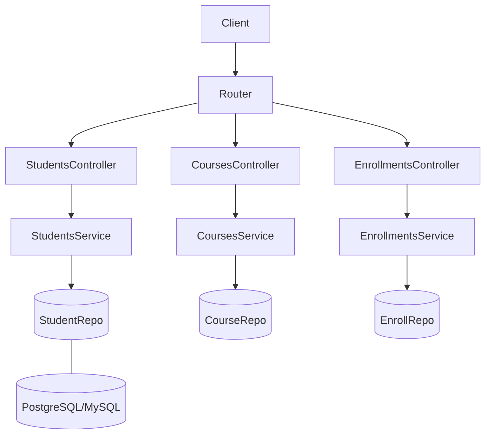

# Architecture Overview

```mermaid
flowchart LR
User[Web / Mobile] --> API[REST API (Express)]
API --> DB[(Relational DB)]
API --> Auth[JWT/MFA / University SSO]
subgraph Services
API
Auth
end
```

## Component Diagram


