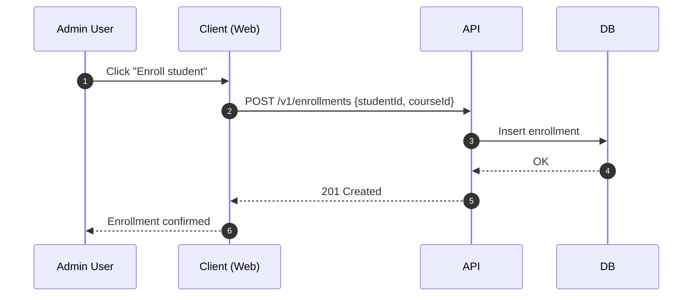

# Sequence: Student Enrollment

```mermaid
%% Enrollment Sequence (Ronald’s SMS)
sequenceDiagram
  autonumber
  participant U as Admin User
  participant C as Client (Web)
  participant A as API
  participant D as DB
  U->>C: Click "Enroll student"
  C->>A: POST /v1/enrollments {studentId, courseId}
  A->>D: Insert enrollment
  D-->>A: OK
  A-->>C: 201 Created
  C-->>U: Enrollment confirmed
```
